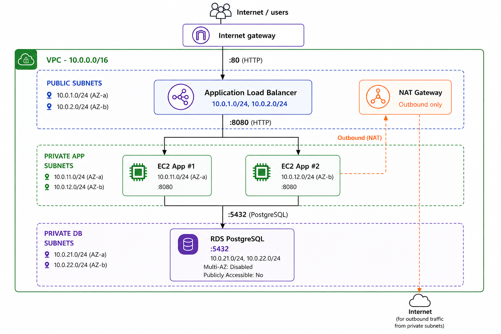
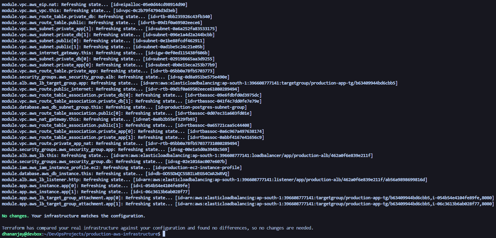
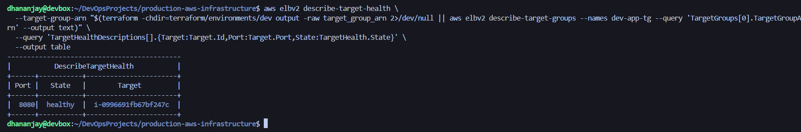
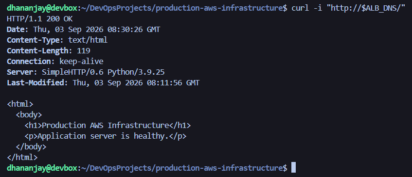
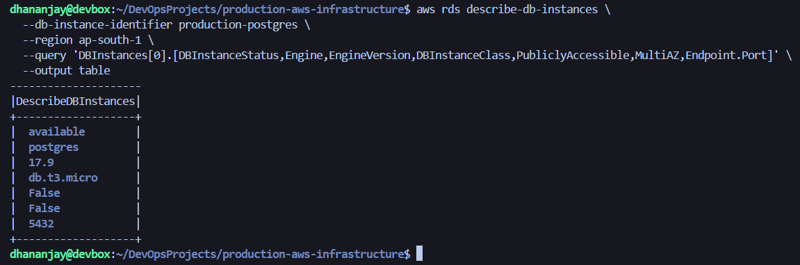
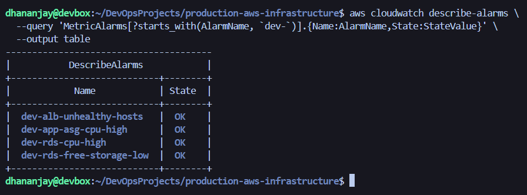

# Production AWS Infrastructure☁️

Production-style AWS infrastructure built with **Terraform** on **Amazon Web Services**.

This project demonstrates a modular, secure, and cost-conscious **3-tier AWS architecture** with an internet-facing Application Load Balancer, private EC2 application servers, and a private PostgreSQL database.

**Note:** This is a production-style portfolio project for learning and demonstrating AWS and DevOps practices. Some production features are intentionally simplified to control cost.


## Overview

The infrastructure is deployed in the **AWS Mumbai region (`ap-south-1`)** across two Availability Zones.

The architecture contains:

- Custom VPC (`10.0.0.0/16`)
- Public subnets for the Application Load Balancer and NAT Gateway
- Private application subnets for EC2 instances
- Private database subnets for PostgreSQL RDS
- Internet Gateway for public connectivity
- NAT Gateway for outbound internet access from private application instances
- Security Groups controlling application traffic
- IAM instance profile for EC2
- IMDSv2 required on EC2 instances
- Reusable Terraform modules
- Auto Scaling Group for EC2 application servers
- CloudWatch alarms for EC2, ALB, and RDS monitoring
- S3 remote Terraform state with state locking
- GitHub Actions CI with AWS OIDC authentication


## Architecture



### Traffic Flow

```text
Internet
   |
   | HTTP :80
   v
Application Load Balancer
   |
   | HTTP :8080
   v
Private EC2 Application Servers
   |
   | PostgreSQL :5432
   v
Private RDS PostgreSQL
```

Private application instances use the NAT Gateway for outbound internet connectivity:

```text
Private EC2
    |
    v
NAT Gateway
    |
    v
Internet
```

The database tier does not have a default route to the internet.


## AWS Services

| AWS Service | Purpose |
|---|---|
| Amazon VPC | Provides the isolated network environment |
| Internet Gateway | Provides internet connectivity for public subnets |
| NAT Gateway | Provides outbound internet access for private application instances |
| Application Load Balancer | Distributes HTTP traffic to application servers |
| Amazon EC2 | Hosts the application servers |
| Amazon RDS | Provides the managed PostgreSQL database |
| IAM | Provides EC2 IAM role and instance profile |
| Elastic IP | Provides the public IP associated with the NAT Gateway |
| Terraform | Provisions infrastructure as code |
| Amazon CloudWatch | Provides infrastructure monitoring and alarms |
| Amazon S3 | Stores remote Terraform state |
| GitHub Actions | Runs Terraform CI checks automatically |

## Network Architecture

### VPC

```text
VPC CIDR: 10.0.0.0/16
Region:    ap-south-1
AZs:       ap-south-1a, ap-south-1b
```

### Public Subnets

| Availability Zone | CIDR | Purpose |
|---|---|---|
| ap-south-1a | `10.0.1.0/24` | ALB / NAT Gateway |
| ap-south-1b | `10.0.2.0/24` | ALB |

Public subnets use the Internet Gateway for internet connectivity.

### Private Application Subnets

| Availability Zone | CIDR | Purpose |
|---|---|---|
| ap-south-1a | `10.0.11.0/24` | EC2 application server |
| ap-south-1b | `10.0.12.0/24` | EC2 application server |

Private application subnets use the NAT Gateway for outbound internet access.

### Private Database Subnets

| Availability Zone | CIDR | Purpose |
|---|---|---|
| ap-south-1a | `10.0.21.0/24` | RDS |
| ap-south-1b | `10.0.22.0/24` | RDS |

The database route table does not contain a default internet route.


## Security

Security Groups enforce the intended application flow:

```text
Internet
   |
   | TCP :80
   v
Application Load Balancer
   |
   | TCP :8080
   v
EC2 Application
   |
   | TCP :5432
   v
RDS PostgreSQL
```

### Security Rules

| Source | Destination | Port | Purpose |
|---|---|---:|---|
| Internet | ALB | `80` | Public HTTP access |
| ALB Security Group | App Security Group | `8080` | Application traffic |
| App Security Group | DB Security Group | `5432` | PostgreSQL traffic |

### Additional Security Controls

- EC2 instances are deployed in private subnets.
- EC2 instances do not receive public IP addresses.
- RDS is not publicly accessible.
- RDS PostgreSQL uses port `5432`.
- EC2 metadata access requires IMDSv2.
- The EC2 IAM role does not have unnecessary AWS API permissions.

### VPC Module

Creates:

- VPC
- Public subnets
- Private application subnets
- Private database subnets
- Internet Gateway
- Route tables
- NAT Gateway
- Elastic IP

### Security Groups Module

Defines controlled traffic between:

```text
Internet → ALB → Application → Database
```

### ALB Module

Creates:

- Application Load Balancer
- Target Group
- Listener
- Auto Scaling Group target registration

### App Module

Creates an EC2 Launch Template and Auto Scaling Group for application servers in private application subnets.

The application listens on:

```text
TCP :8080
```

### Database Module

Creates:

- PostgreSQL RDS instance
- DB subnet group
- Private database connectivity

### IAM Module

Creates the EC2 IAM role and instance profile.

The application does not require AWS API access, so no additional AWS permissions are attached.

### Monitoring Module

Creates CloudWatch alarms for:

- EC2 Auto Scaling Group CPU utilization
- ALB unhealthy targets
- RDS CPU utilization
- RDS free storage

## Deployment

### Prerequisites

Install and configure:

- AWS CLI
- Terraform
- AWS credentials with appropriate permissions

Verify AWS authentication:

```bash
aws sts get-caller-identity
```

### Initialize Terraform

Each environment uses an S3 remote backend for Terraform state with state locking.

```bash
cd terraform/environments/dev

terraform init
```

### Format Terraform

```bash
terraform fmt -recursive
```

### Validate Configuration

```bash
terraform validate
```

### Create a Terraform Plan

The database password is provided through an environment variable.

```bash
export TF_VAR_db_master_password='REPLACE_WITH_STRONG_PASSWORD'

terraform plan
```

> Never commit passwords, secrets, `.tfvars` files containing secrets, Terraform state files, or generated plan files.

### Apply Infrastructure

```bash
terraform apply
```

Review the Terraform plan carefully before confirming the deployment.

### Destroy Infrastructure

When testing is complete:

```bash
terraform destroy
```

> The infrastructure contains billable AWS resources such as EC2, RDS, ALB, and NAT Gateway. Destroy unused resources to avoid unnecessary charges.

### CI with GitHub Actions

Terraform checks are automated using GitHub Actions.

The workflow runs for both `dev` and `prod` environments and performs:

- Terraform formatting checks
- Terraform initialization
- Terraform validation
- Terraform plan

AWS authentication uses GitHub Actions OIDC with a dedicated IAM role instead of storing long-lived AWS access keys.

## Validation

The infrastructure was deployed and validated in AWS before cleanup.

### Terraform Plan

The final Terraform configuration was verified against the deployed infrastructure.



### ALB Target Health

The EC2 application instance managed by the Auto Scaling Group successfully registered as a healthy target on port 8080.



### Application

The application was accessed through the Application Load Balancer and returned HTTP `200 OK`.



### RDS

The PostgreSQL RDS instance was verified with:

- PostgreSQL 17
- `db.t3.micro`
- Private connectivity
- `PubliclyAccessible = false`
- Port `5432`
- Multi-AZ disabled



### CloudWatch Alarms

The infrastructure includes CloudWatch alarms for:

- EC2 Auto Scaling Group CPU utilization
- ALB unhealthy targets
- RDS CPU utilization
- RDS free storage

All configured alarms were verified after deployment.



## Cost & Production Trade-offs

The infrastructure was intentionally designed with cost awareness for a learning and portfolio environment.

Cost-conscious decisions include:

- Single NAT Gateway
- `t3.micro` EC2 instances
- `db.t3.micro` RDS
- RDS Multi-AZ disabled
- Short backup retention
- Destroying resources after testing

### Single NAT Gateway

A single NAT Gateway reduces cost compared with deploying one NAT Gateway per Availability Zone.

The trade-off is reduced high availability.

A production environment requiring stronger availability would typically use a NAT Gateway architecture designed per Availability Zone.

### Design Trade-offs

| Area | Current Design | Production Improvement |
|---|---|---|
| NAT Gateway | Single NAT Gateway | NAT Gateway per AZ |
| RDS | Single-AZ | Multi-AZ |
| Load Balancer | HTTP | HTTPS with ACM |
| Database Credentials | Terraform variable | AWS Secrets Manager |
| Terraform State | S3 remote backend with state locking | Centralized remote state with stronger collaboration and recovery |
| AMI | Explicit AMI ID | Dynamic AMI / SSM lookup |
| RDS Deletion | Destroy-friendly | Deletion protection + final snapshot |
| Egress | Broad outbound access | More restrictive egress controls |
| Monitoring | CloudWatch alarms | Dashboards, centralized observability, and alerting |
| CI/CD | GitHub Actions Terraform CI | Automated apply with approvals and deployment controls |

These trade-offs were intentional and balance **architecture quality, learning value, and cost**.

## Key Takeaways

VPC networking, public/private subnet design, NAT/IGW routing, ALB, EC2 Auto Scaling, private RDS PostgreSQL, security groups, IAM, IMDSv2, CloudWatch monitoring, S3 remote Terraform state, and GitHub Actions CI with AWS OIDC.
